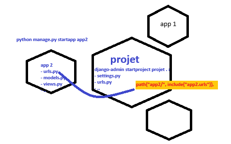

# Django – Mappage (URL Routing) & Modèles

> Petit mémo clair et actionnable pour comprendre **comment Django route les URLs** vers des vues et **comment créer/activer des modèles**.

---

## 🧭 Le rôle du « mappage »

Le **mappage des URLs** (ou *URL routing*) sert à dire à Django :

> "Quand un utilisateur visite telle URL dans son navigateur, **quelle fonction (vue)** doit être exécutée pour répondre ?"

Django lit l'URL et choisit la bonne *vue Python* à appeler.



---

## 🏗️ Le cheminement complet d'une requête

Prenons un projet d'exemple :

```
mysite/
│
├── mysite/
│   ├── urls.py          ← routes principales du projet
│
├── polls/
│   ├── urls.py          ← routes spécifiques à l'app "polls"
│   ├── views.py         ← fonctions/classes qui répondent aux requêtes
│
└── manage.py
```

Supposons que quelqu'un visite :

```
http://127.0.0.1:8000/polls/
```

Voici ce qui se passe 👇

### Étape 1 : Django commence dans `mysite/urls.py`

```python
# mysite/urls.py
from django.contrib import admin
from django.urls import path, include

urlpatterns = [
    path("admin/", admin.site.urls),
    path("polls/", include("polls.urls")),
]
```

🧩 Cela dit à Django :

> "Si l'URL commence par /polls/, va chercher la suite du chemin dans le fichier polls/urls.py."

### Étape 2 : Django charge `polls/urls.py`

```python
# polls/urls.py
from django.urls import path
from . import views

urlpatterns = [
    path("", views.index, name="index"),
]
```

🧩 Cela dit :

> "Si, après /polls/, il n'y a rien de plus (""), alors appelle la vue views.index."

### Étape 3 : Django appelle la vue correspondante

```python
# polls/views.py
from django.http import HttpResponse

def index(request):
    return HttpResponse("Bienvenue sur la page des sondages !")
```

💬 Django exécute cette fonction et renvoie le résultat (HttpResponse) au navigateur.

### ✅ Résultat final

En visitant :

```
http://127.0.0.1:8000/polls/
```

Django affiche :

```
Bienvenue sur la page des sondages !
```

---

## 🧩 Résumé visuel du flux

```
Navigateur → urls.py (mysite) → include(polls.urls)
             ↓
          polls/urls.py → views.index
             ↓
        views.py → renvoie une réponse HTTP
             ↓
        Navigateur affiche la page
```

---

# Modèles

## 🧱 Création et modification de modèles

Les modèles se créent dans le fichier **models.py** d'une app Django.

```python
# polls/models.py
from django.db import models

class Question(models.Model):
    question_text = models.CharField(max_length=200)
    pub_date = models.DateTimeField('date publiée')

    def __str__(self):
        return self.question_text

class Choice(models.Model):
    question = models.ForeignKey(
        Question,
        on_delete=models.CASCADE,
        related_name="choices"
    )
    choice_text = models.CharField(max_length=200)
    votes = models.IntegerField(default=0)

    def __str__(self):
        return self.choice_text
```

---

## ⚙️ Activation des modèles (migrations)

### Créer les migrations

```bash
python manage.py makemigrations
```

➜ Génère les fichiers de migration correspondant aux changements de modèles.

### Appliquer les migrations

```bash
python manage.py migrate
```

➜ Met à jour la base de données selon les modèles.

💡 **Pourquoi deux étapes ?**  
Les migrations sont des fichiers versionnables (elles peuvent être partagées entre développeurs et appliquées plus tard).

---

## 🐚 Créer des objets dans le shell

Lancer le shell Django :

```bash
python manage.py shell
```

Puis :

```python
from polls.models import Question, Choice
from django.utils import timezone

q = Question.objects.create(
    question_text="Ton langage préféré ?",
    pub_date=timezone.now()
)
Choice.objects.create(question=q, choice_text="Python", votes=0)
Choice.objects.create(question=q, choice_text="JavaScript", votes=0)
```

---

## 🔗 Clé étrangère (ForeignKey)

- Sert à **lier** un modèle à un autre (ex : `Choice` → `Question`)
- `on_delete=models.CASCADE` : supprime les `Choice` liés quand la `Question` est supprimée
- `related_name="choices"` permet d'accéder à la relation inverse facilement :

```python
q.choices.all()  # au lieu de q.choice_set.all()
```

---

## 💬 Méthode `__str__()`

Sert à afficher un nom lisible dans l'admin et le shell :

```python
def __str__(self):
    return self.question_text
```

---

## 🔍 Requêtes et filtrages (Lookup API)

```python
Question.objects.filter(pub_date__year=2025)
Choice.objects.filter(question__question_text__icontains="langage")
Question.objects.get(pk=1)
Question.objects.order_by('-pub_date')
```

---

## 👑 Interface d'administration

### Créer un superutilisateur

```bash
python manage.py createsuperuser
```

### Enregistrer les modèles dans l'admin

```python
# polls/admin.py
from django.contrib import admin
from .models import Question, Choice

admin.site.register(Question)
admin.site.register(Choice)
```

---

## 🧠 Résumé express

| Étape | Action               | Commande / Fichier                                 |
|-------|----------------------|----------------------------------------------------|
| 1     | Créer/éditer modèles | `polls/models.py`                                  |
| 2     | Générer migrations   | `python manage.py makemigrations`                  |
| 3     | Appliquer migrations | `python manage.py migrate`                         |
| 4     | Tester dans le shell | `python manage.py shell`                           |
| 5     | Clé étrangère        | `ForeignKey(..., on_delete=..., related_name=...)` |
| 6     | Admin                | `createsuperuser` + `admin.site.register()`        |